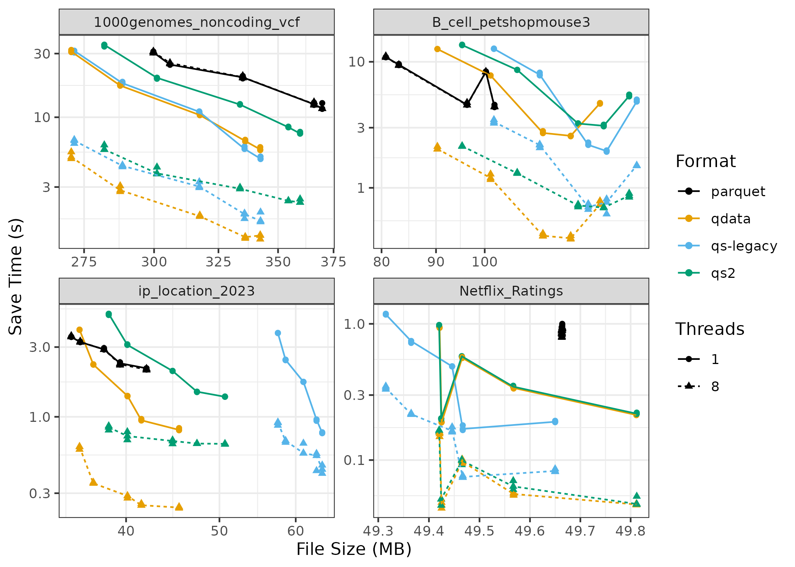
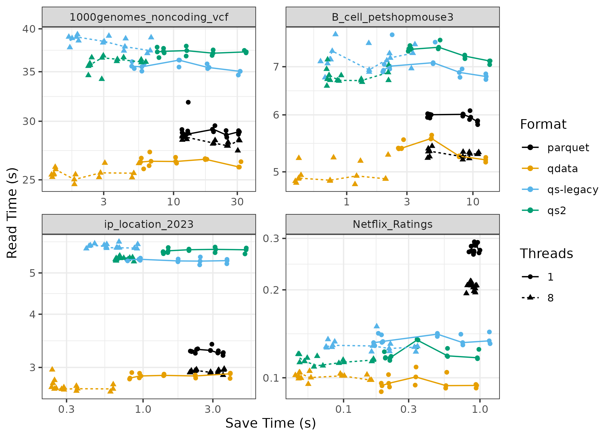
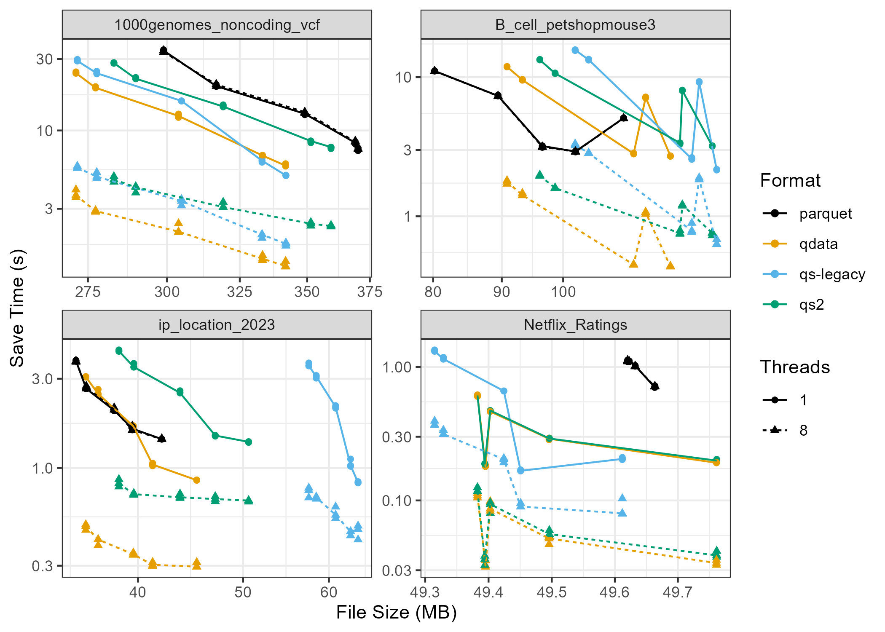
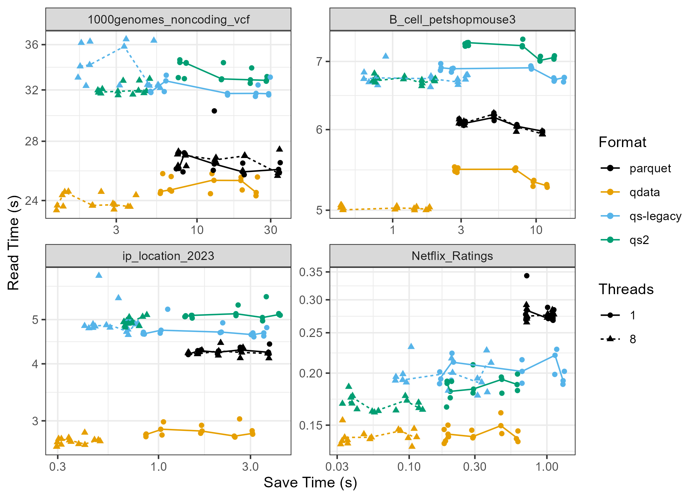

# Analyses and Benchmarks for the qs2 R package

This package provides a collection of analyses and benchmarks for the [qs2](https://github.com/qsbase/qs2) R package. 

20 datasets were collected in total. 16 were used for training in order to optimize performance with respect to hyper-parameters and design choices. The remaining 4 datasets were used for benchmarks and evaluation of the performance of the qs2 package. 

All datasets are openly licensed. Please feel free to use this collection of datasets and cite the qs2 package!

# Benchmark plots

## Save time vs file size (Ubuntu)

## Read time vs save time (Ubuntu)

## Save time vs file size (Windows)

## Read time vs save time (Windows)

# Datasets

## Training

### 1. GAIA celestial pseudocolor dataset
- **License**: Other ([link](https://www.cosmos.esa.int/web/gaia-users/license))
- **Description**: Data used for pseudocolor plot of galaxy stars.

### 2. enwik8 (Wikipedia data)
- **License**: Unspecified
- **Description**: A single column dataset with the first 100 million lines from Wikipedia.

### 3. T-cell data
- **License**: CC BY 4.0
- **Reference**: [Adaptive Biotech COVID-2020](https://clients.adaptivebiotech.com/pub/covid-2020)
- **Description**: A large-scale database of T-cell receptor beta (TCRβ) sequences for SARS-CoV-2 studies.

### 4. MNIST
- **License**: Artistic-2.0
- **Reference**: [dslabs package](https://cran.r-project.org/web/packages/dslabs/index.html)
- **Description**: Handwritten digits data for digit recognition.

### 5. RNA-Seq GTEx heart data
- **License**: Artistic-2.0
- **Reference**: [recount3 package](https://bioconductor.org/packages/release/bioc/html/recount3.html)
- **Description**: Gene expression counts for human heart samples.

### 6. EU Copernicus ERA5 wind data
- **License**: Other ([link](https://www.copernicus.eu/en/access-data/copyright-and-licences))
- **Reference**: [Copernicus Climate Data Store](https://cds.climate.copernicus.eu/)
- **Description**: Monthly means of wind data at 10 meters height for 2023.

### 7. Berkeley 2010-2019 global temperature
- **License**: CC BY-NC 4.0
- **Reference**: [Berkeley Earth](https://berkeleyearth.org/data/)
- **Description**: Global temperature data from 2010 to 2019.

### 8. OpenStreetMap (OSM) data for Oahu
- **License**: Open Data Commons ODbL
- **Reference**: [OSM Downloading Data](https://wiki.openstreetmap.org/wiki/Downloading_data)
- **Description**: Map data of the Oahu region from OpenStreetMap.

### 9. NYC vehicle collisions
- **License**: Public access
- **Description**: Dataset on motor vehicle collisions and crashes in NYC.

### 10. Methylation volcano data
- **License**: Artistic-2.0
- **Reference**: [methylationArrayAnalysis](https://bioconductor.org/packages/release/workflows/html/methylationArrayAnalysis.html)
- **Description**: DNA methylation data for epigenetic studies.

### 11. Clifford attractor
- **License**: N/A
- **Reference**: [Clifford attractor](https://paulbourke.net/fractals/clifford/)
- **Description**: Fractal data generated using the Clifford attractor.

### 12. Twitter Sentiment140
- **License**: N/A
- **Reference**: Go, A., Bhayani, R., and Huang, L., 2009
- **Description**: Sentiment analysis data from Twitter.

### 13. Steam game database 2024
- **License**: MIT
- **Reference**: [Steam Games Dataset](https://www.kaggle.com/datasets/artermiloff/steam-games-dataset)
- **Description**: A dataset of games on the Steam platform.

### 14. Protein structure PISCES
- **License**: DbCL v1.0
- **Reference**: Wang, Guoli, and Roland L. Dunbrack Jr. "PISCES"
- **Description**: Data on protein secondary structure.

### 15. DC real estate listings 2024
- **License**: CC BY-NC-SA 4.0
- **Reference**: [Washington D.C. housing market dataset](https://www.kaggle.com/datasets/datadetective08/washington-d-c-housing-market-2024)
- **Description**: Real estate listings in Washington, D.C.

### 16. NYSE stock prices (1962-2024)
- **License**: Apache 2.0
- **Reference**: [Stock prices dataset](https://www.kaggle.com/datasets/eren2222/nasdaq-nyse-nyse-a-otc-daily-stock-1962-2024)
- **Description**: Daily stock prices for NYSE stocks.

## Testing

### 17. 1000 Genomes non-coding VCF
- **License**: CC BY-NC-SA 3.0
- **Reference**: 1000 Genomes Project Consortium, Nature 526
- **Description**: Annotated VCF files of non-coding regions in human genomes.

### 18. B-cell AIRR data ("Pet shop mouse 3")
- **License**: N/A
- **Reference**: [Project page](https://www.ebi.ac.uk/ena/browser/view/PRJEB18631)
- **Description**: Data on antibody/B-cell and T-cell receptor repertoires.

### 19. IP location dataset (2023)
- **License**: CC BY 4.0
- **Reference**: [Global IP dataset](https://www.kaggle.com/datasets/joebeachcapital/global-ip-dataset-by-location-2023)
- **Description**: Geolocation data for IP addresses globally.

### 20. Netflix movie ratings
- **License**: CC0 Public Domain
- **Reference**: [Netflix movie rating dataset](https://www.kaggle.com/datasets/rishitjavia/netflix-movie-rating-dataset)
- **Description**: Movie ratings data from Netflix.